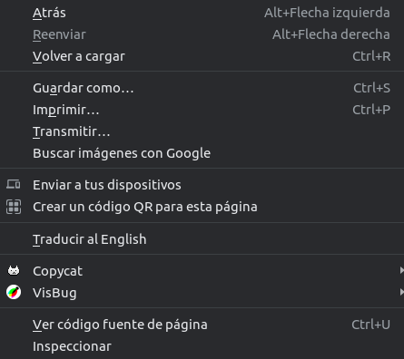
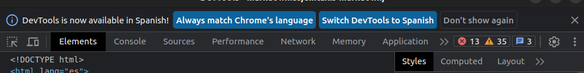
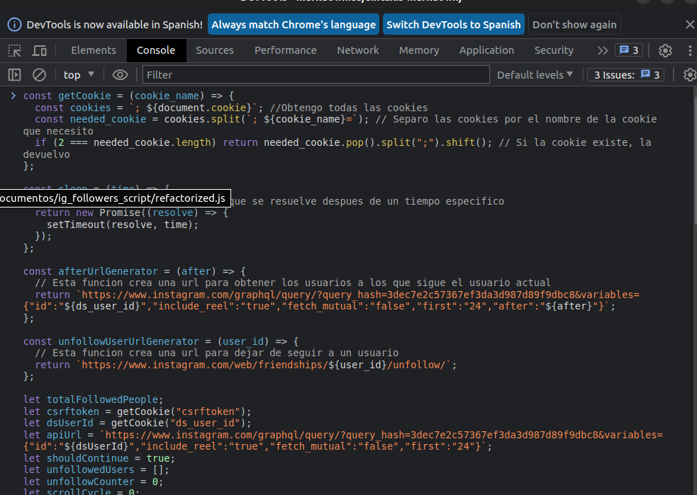

# Script para ver personas que sigues y no te siguen

Este codigo no es de mi autoria, pero fue refactorizado y comentado por mi para validar su seguridad y legibilidad.

## ¿Como usar?

- Ve a tu perfil de Instagram (Debe ser obligatoriamente en PC)
- Una vez en tu perfil:
- - Click derecho: Inspeccionar elemento
- - 
- - En la seccion superior dirigete a donde dice "Consola":
    
- - Pegamos el codigo (original.js o refactorized.js, hacen lo mismo)
    

Y listo, nos va a listar los usuarios

## Si tienes algun problema al usar este codigo puedes ir a la pestaña de arriba "Issues" y comentarme el problema para que le de solucion
